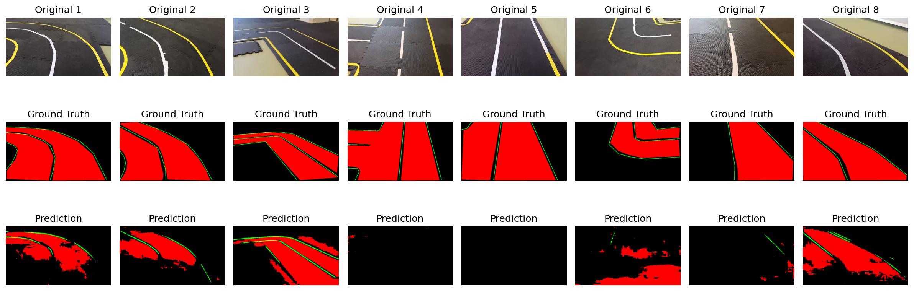
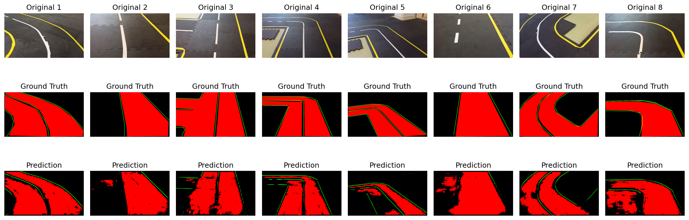
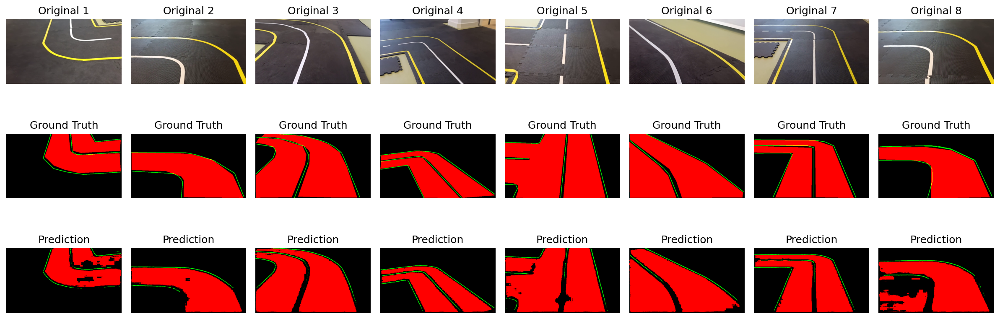
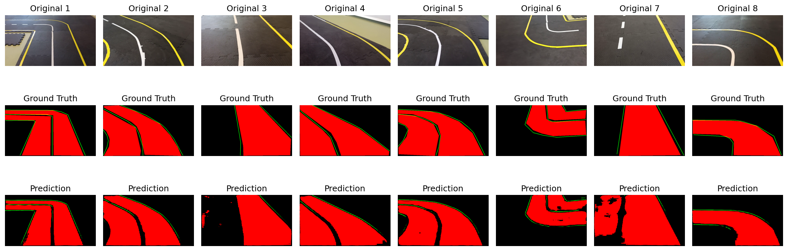
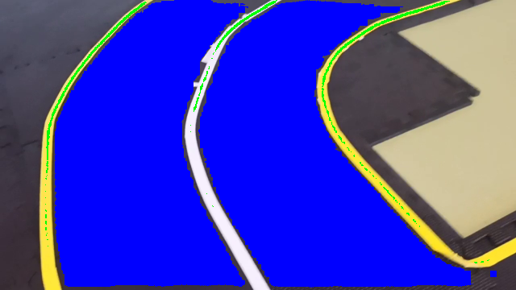
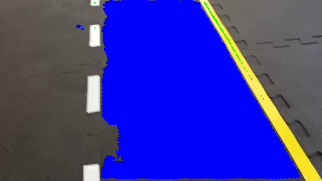
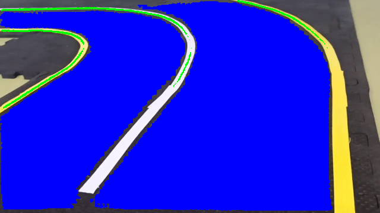
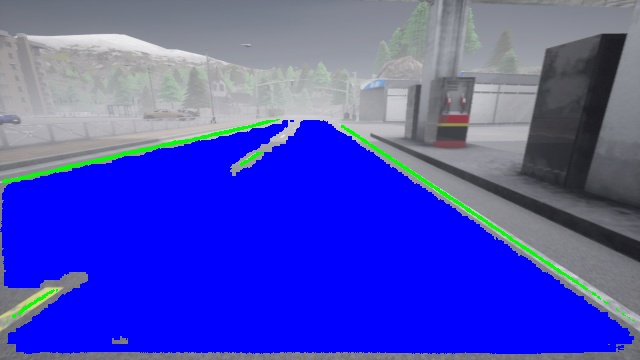

# TwinLiteNet-Based Lane Detection and Segmentation System

This project implements a comprehensive computer vision system for lane detection and road segmentation based on the TwinLiteNet architecture. The system includes both training capabilities and a complete annotation toolkit with custom widgets for computer vision applications.

## System Overview

Our implementation extends the TwinLiteNet architecture to generate both **driving area masks** and **lane line detection** for autonomous driving applications. The system provides end-to-end functionality from data annotation to model training and inference.

## Core Components

### **TwinLiteNet Model Architecture**

The model is based on the TwinLiteNet architecture, specifically designed for real-time semantic segmentation tasks. Our implementation generates two primary outputs:

- **Driving Area Segmentation**: Binary masks identifying drivable road areas
- **Lane Line Detection**: Precise lane line segmentation for navigation guidance

The model uses a dual-branch architecture that efficiently processes both segmentation tasks simultaneously, making it suitable for real-time applications on embedded systems.

### **Training Pipeline (treino.py)**

Our training system includes several advanced features for robust model development:

**Transfer Learning Support**

- Pretrained weight loading with flexible layer matching
- Backbone freezing capabilities for fine-tuning
- Gradual unfreezing strategies for optimal convergence

**Advanced Training Features**

- Early stopping with configurable patience
- Automatic learning rate scheduling
- Comprehensive visualization generation during training
- Real-time training curve plotting

**Data Augmentation**

- Color space augmentations for improved generalization
- Geometric transformations for robustness

**Monitoring and Visualization**

- Automatic prediction visualization every 2 epochs
- Training metrics tracking (loss, IoU, accuracy)
- Progress monitoring with detailed statistics


### **Computer Vision Annotation Toolkit (editor.py)**

We developed a comprehensive widget-based annotation system using PyGame and PyWidgets, specifically designed for computer vision tasks:

**Custom Widget Implementation**

- **Multi-mode Drawing System**: Line drawing, polygon creation, and point editing modes
- **Interactive Controls**: Sliders for thickness and selection radius adjustment
- **Real-time Statistics**: Progress bars and value widgets for dataset monitoring
- **Advanced UI Components**: Radio groups, checkboxes, and foldout panels

**Annotation Capabilities**

- **Line Annotation**: For lane line marking with adjustable thickness
- **Polygon Segmentation**: For driving area definition with fill capabilities
- **Point-based Editing**: Precise control over annotation geometry
- **Batch Processing**: Export entire datasets with progress tracking

**Professional Features**

- **Auto-save Functionality**: Automatic annotation preservation
- **Coordinate Transformation**: Seamless conversion between screen and image coordinates
- **Multi-format Export**: PNG mask generation for training pipelines
- **Keyboard Shortcuts**: Efficient workflow with hotkey support


## Technical Implementation

### **Mask Generation Pipeline**

The system generates two types of masks:

1. **Lane Line Masks**: Binary images where lane lines are represented as white pixels with configurable thickness
2. **Segmentation Masks**: Filled polygon areas representing drivable regions

Both mask types are automatically scaled to match the original image dimensions and exported in training-ready formats.

### **Widget Architecture**

## Visualizações Interativas
[pywidget.md](pywidget.md).

Our custom widget system provides:

- **Modular Design**: Each widget is independently configurable and reusable
- **Event-driven Architecture**: Responsive UI with proper callback handling
- **State Management**: Persistent application state across sessions
- **Cross-platform Compatibility**: Works across different operating systems


### **Training Enhancements**

The training pipeline includes several optimizations:

- **Memory Efficiency**: Optimized data loading with configurable batch sizes
- **GPU Acceleration**: CUDA support with automatic device detection
- **Robust Checkpointing**: Complete state preservation for training resumption
- **Flexible Architecture**: Support for different backbone networks


## Usage Examples

### **Training a Model**

```python
# Basic training with pretrained weights
python treino.py --pretrained ./pretrained/best.pth --lr 5e-5

# Advanced training with transfer learning
python treino.py --pretrained ./pretrained/best.pth --freeze_backbone --unfreeze_epoch 15 --lr 1e-4 --patience 20
```


### **Annotation Workflow**

The annotation tool provides an intuitive interface for creating training datasets:

1. **Load Images**: Select folder containing road images
2. **Draw Annotations**: Use line mode for lane markings, polygon mode for driving areas
3. **Edit Precisely**: Switch to edit mode for fine-tuning point positions
4. **Export Dataset**: Generate masks automatically for training pipeline

## Key Innovations

**Dual-Purpose Architecture**: Our system serves both as a production-ready lane detection solution and a comprehensive development toolkit for computer vision researchers.

**Widget-Based Annotation**: The custom widget system provides professional-grade annotation capabilities typically found in commercial computer vision tools.

**Integrated Pipeline**: Seamless workflow from annotation through training to inference, eliminating common integration challenges in computer vision projects.

This implementation demonstrates how modern deep learning architectures can be combined with sophisticated tooling to create complete computer vision solutions for autonomous driving applications.


**Train Progress**






**Samples**






- **Vídeo 1**: [Lab](Videos/demo1.mp4)
- **Vídeo 2**: [Lab](Videos/demo2.mp4)
- **Vídeo 3**: [Lab](Videos/demo3.mp4)
 
 