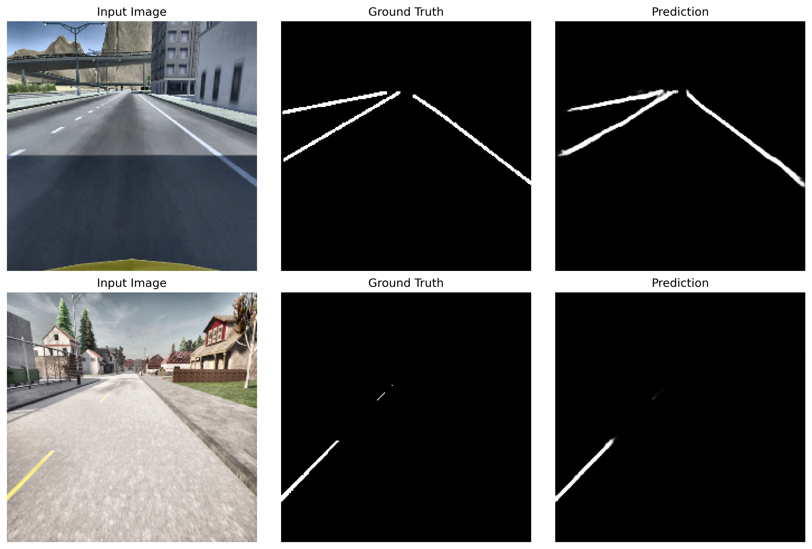
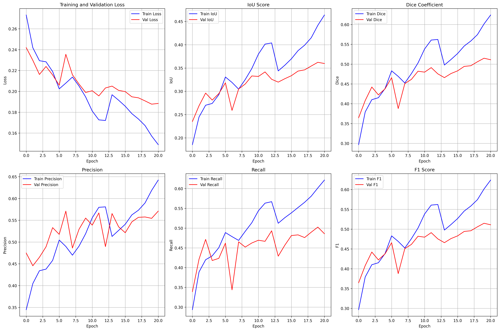
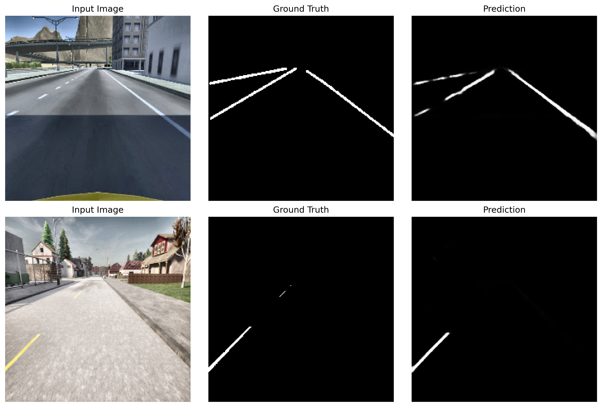
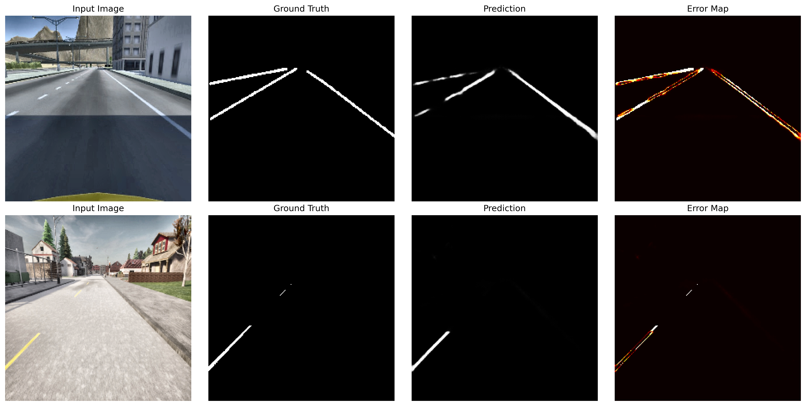
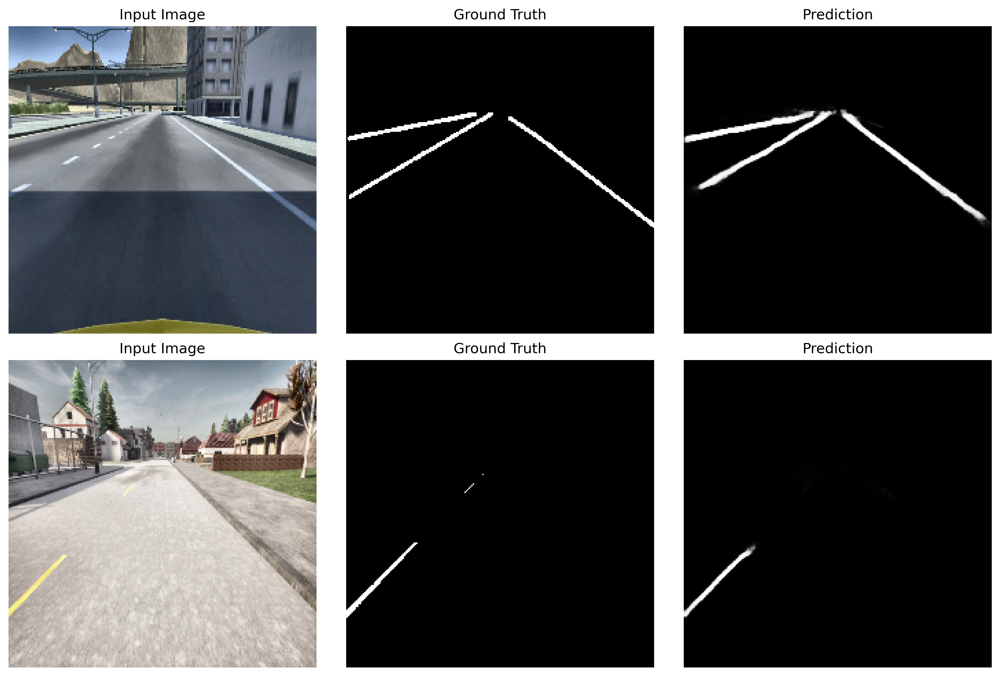
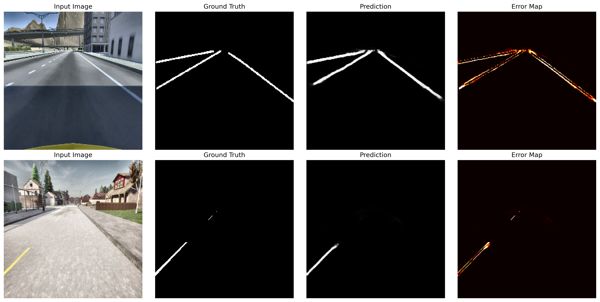
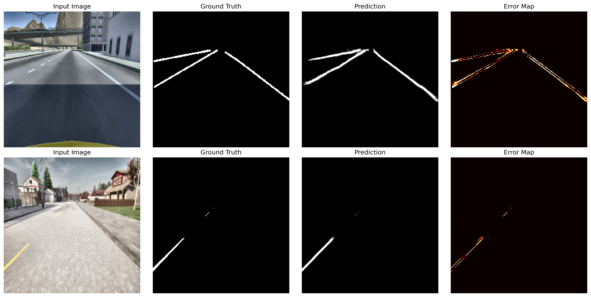

# LineNet — Lightweight Lane‑Line Segmentation (PyTorch)


> **Purpose.** Pixel‑wise lane‑line segmentation from a single forward camera frame. Designed to be **small, fast, and Jetson‑friendly**.

<p align="center">
  
  <br/>
  <sub>Example predictions on validation frames (epoch 20).</sub>
</p>

---

## Highlights

* **MobileNetV2‑style encoder** (Inverted Residual + depthwise separable convs)
* Optional **SE** (Squeeze‑and‑Excitation) and **ASPP** for strong variants
* **U‑like decoder with skip connections**, transposed conv upsampling and a depthwise fusion block on each stage
* **Noise‑reduction head** for robustness in lab/LED noise
* **Variants:** `nano`, `lite`, `small`, `medium`, `strong` — scale params & features to your device
* Training script with **IoU/Dice/Precision/Recall/F1**, early stopping and rich visualizations
* Inference helper class + **ONNX export** for Jetson/TensorRT

> Core files: `linenet.py` (model), `train.py` (training), `inference.py` (runtime), `to_jetson.py` (ONNX export), `main.cpp` (optional C++ sample).

---

## Table of Contents

1. [Quick Start](#quick-start)
2. [Dataset Layout](#dataset-layout)
3. [Train](#train)
4. [Evaluate & Visualize](#evaluate--visualize)
5. [Inference (Python)](#inference-python)
6. [Export to ONNX / Jetson](#export-to-onnx--jetson)
7. [Model Architecture & Variants](#model-architecture--variants)
8. [Quality, Tests & CI](#quality-tests--ci)
9. [Project Structure](#project-structure)
10. [FAQ](#faq)
11. [References](#references)

---

## Quick Start

### 1) Environment

```bash
python -m venv .venv && source .venv/bin/activate
pip install --upgrade pip
# CPU wheels (good for CI). For CUDA, install matching wheels from pytorch.org
pip install --extra-index-url https://download.pytorch.org/whl/cpu \
  torch==2.3.* torchvision==0.18.* torchaudio==2.3.*

pip install albumentations opencv-python pillow matplotlib numpy tqdm wandb
```

### 2) Data paths

Organize images & masks (see layout below) and note the root folders.

---

## Dataset Layout

```
<DATA_ROOT>/
  images/  # RGB frames (jpg|jpeg|png|bmp)
  masks/   # single‑channel lane masks (png, 0/255)
```

* Files are matched by **stem**: `images/abc.jpg` ↔ `masks/abc.png`.
* Loader resizes to the chosen `--image_size` (default **224×224**), normalizes masks to **\[0,1]**, and returns **(B,1,H,W)**.

---

## Train

Typical run (balanced efficiency/accuracy):

```bash
python train.py \
  --train_images /path/to/images \
  --train_masks  /path/to/masks  \
  --variant small \
  --batch_size 8 --epochs 100 --learning_rate 1e-3 \
  --image_size 224 224 \
  --visualize_every 5 \
  --experiment_name small_224
```

Useful flags:

* `--val_images/--val_masks` to use a separate validation split (else a random split is created with `--val_split`, default 0.2)
* `--use_wandb --wandb_project linennet` for online logging
* `--resume <checkpoint.pth>` to resume training (optimizer, scheduler restored)

**Artifacts** (under `./outputs/<experiment_name>/`):

* `best_model.pth`, `checkpoint_epoch_XX.pth`, `final_model.pth`
* `predictions_epoch_XX.png`, `errors_epoch_XX.png` (grids)
* `final_training_curves.png` (loss & metrics)
* `training.log` (text log)

**Early Stopping.** Stops on validation **Dice** stagnation with patience (default 20).

---

## Evaluate & Visualize

During training, the script tracks:

* **IoU, Dice, Precision, Recall, F1** (per epoch)
* A grid image per N epochs: **Input | GT | Prediction** and an **Error heatmap**
* Periodic **curves** (loss/IoU/Dice/Precision/Recall/F1)

---

## Inference (Python)

Simple example using the helper class:

```python
import cv2
from inference import LineNetInference

infer = LineNetInference(model_path='outputs/small_224/best_model.pth',
                         variant='small', device='auto', input_size=(224,224))

frame = cv2.imread('demo.jpg')
mask, prob = infer.predict(frame, threshold=0.5)  # mask: uint8 [0,255]
cv2.imwrite('demo_mask.png', mask)
```

Notes:

* Preprocessing uses **ImageNet mean/std** and converts BGR→RGB if needed.
* Output is a **sigmoid map**; `threshold` gives a binary mask.

---

## Export to ONNX / Jetson

Export a trained model (opset 11, dynamic batch):

```bash
python to_jetson.py  # edit paths/variant inside the script
# produces: model.onnx
```

Optional quick TensorRT build on Jetson:

```bash
/usr/src/tensorrt/bin/trtexec --onnx=model.onnx --saveEngine=model.plan \
  --workspace=1024 --fp16  # add --int8 if calibrated
```

---

## Model Architecture & Variants

**Encoder.** MobileNetV2 *Inverted Residual* blocks with depthwise separable convs. Later stages optionally enable **SE**. Stronger variants add **ASPP** for multi‑scale context.

**Decoder.** Multi‑stage upsampling (ConvTranspose2d×2) with skip connections from encoder stages. Each stage fuses with a **depthwise separable** conv. Final upsample → **noise‑reduction** DW‑conv → 1×1 output → **sigmoid**.

**Variants & intended use**

* `nano` — ultra‑light for edge/MCU‑class or high FPS
* `lite` — fast on Jetson Nano/Xavier‑NX
* `small` — good balance (recommended baseline)
* `medium` — higher accuracy (SE + ASPP)
* `strong` — maximum accuracy (SE + ASPP, larger widths)

Call `model.get_model_info()` for parameter counts and estimated size.

---

## Quality, Tests & CI

Add quick tests and a workflow to keep the branch professional.

### 1) Unit tests (`tests/test_smoke.py`)

```python
import torch
from linenet import create_linenet


def test_forward_shape():
    m = create_linenet(variant='small', num_classes=1)
    x = torch.randn(1, 3, 224, 224)
    y = m(x)
    assert y.shape == (1, 1, 224, 224)
    assert torch.all(y.ge(0) & y.le(1))  # sigmoid range


def test_variants_forward():
    for v in ['nano','lite','small','medium','strong']:
        m = create_linenet(variant=v, num_classes=1).eval()
        x = torch.randn(1, 3, 96, 96)
        with torch.no_grad():
            y = m(x)
        assert y.ndim == 4 and y.shape[1] == 1
```

Run locally:

```bash
pip install pytest
pytest -q
```

### 2) GitHub Actions (`.github/workflows/ci.yml`)

```yaml
name: CI
on:
  push: { branches: [ LiteNet ] }
  pull_request: { branches: [ LiteNet ] }
concurrency:
  group: ${{ github.workflow }}-${{ github.ref }}
  cancel-in-progress: true
jobs:
  test:
    runs-on: ubuntu-latest
    steps:
      - uses: actions/checkout@v4
      - uses: actions/setup-python@v5
        with:
          python-version: '3.11'
          cache: 'pip'
      - name: Install deps (CPU wheels)
        run: |
          python -m pip install --upgrade pip
          pip install --extra-index-url https://download.pytorch.org/whl/cpu \
            torch==2.3.* torchvision==0.18.* torchaudio==2.3.*
          pip install albumentations opencv-python pillow matplotlib numpy tqdm pytest
      - name: Run tests
        run: pytest -q
```


---

## Project Structure

```
.
├── linenet.py        # Model: encoder/decoder, variants, get_model_info()
├── train.py          # Training loop, metrics, early stopping, visuals
├── inference.py      # LineNetInference: preprocess → predict → postprocess
├── to_jetson.py      # ONNX export (dynamic axes, opset 11)
├── main.cpp          # (optional) C++ sample for deployment
├── outputs/          # training artifacts (created automatically)
└── tests/            # unit tests for CI
```

---

## FAQ

**Q: My masks are not being read.**  Ensure they are **PNG** and have the **same stem** as the image (`abc.jpg` ↔ `abc.png`).

**Q: Predictions look blurry.**  Try a larger input size (`--image_size 256 256`) or switch to the `medium`/`strong` variant.

**Q: FPS on Jetson is low.**  Export to ONNX and build a TensorRT engine with `--fp16`; reduce image size to 192 or 160, and pick `lite`/`nano` variant.

---

## Results & Visuals (Artifacts)

**Training curves**



**Predictions & error maps**

* Epoch 5
  Predictions: 
  Errors: 
* Epoch 15
  Predictions: 
  Errors: 
* Epoch 20
  Predictions: 
  Errors: 


---

## References

* Sandler et al., *MobileNetV2: Inverted Residuals and Linear Bottlenecks*, CVPR 2018
* Hu et al., *Squeeze‑and‑Excitation Networks*, CVPR 2018
* Chen et al., *DeepLab / ASPP*, ECCV/TPAMI 2017–2018
* Albumentations: Buslaev et al., 2020
* TensorRT & ONNX runtimes (NVIDIA / ONNX)

---

 